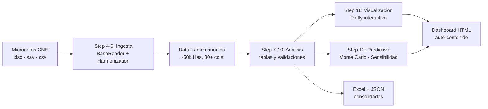

# Análisis de Microdatos — Encuestas Presidenciales Colombia 2026

[](https://colab.research.google.com/github/EnriqueForero/encuestas-presidenciales-2026/blob/main/notebooks/00_run_full_pipeline.ipynb)
[](https://www.python.org/downloads/)
[](#tests)
[](CHANGELOG.md)
[](LICENSE)

Pipeline reproducible para **armonizar, ponderar, analizar y visualizar**
microdatos de encuestas presidenciales de Colombia 2026 publicados por el
Consejo Nacional Electoral (CNE). Convierte archivos heterogéneos (Atlas,
GAD3, Invamer, CNC en formatos `.xlsx`/`.sav`/`.csv`) en un único DataFrame
canónico, calcula 15+ análisis tabulares, simula segunda vuelta con Monte
Carlo y exporta un dashboard HTML interactivo.

> Refactor profesional del repositorio
> [Analisis-microdatos-encuestas](https://github.com/PabloManriqueo/Analisis-microdatos-encuestas).
> Cambios principales documentados en [CHANGELOG.md](CHANGELOG.md).

---

## 🚀 Quick start

### Opción A — Google Colab (recomendado, gratuito)

Abre el notebook directamente:

[](https://colab.research.google.com/github/EnriqueForero/encuestas-presidenciales-2026/blob/main/notebooks/00_run_full_pipeline.ipynb)

El notebook se encarga de **todo**: instalar dependencias, montar Google
Drive, cargar los microdatos, ejecutar 4 fases del pipeline (Step 1–10),
generar gráficas Plotly interactivas (Step 11) y correr el análisis
predictivo Monte Carlo (Step 12). Sin nada que instalar localmente.

Tras abrirlo, sigue tres pasos en el notebook:

1. Copia la carpeta del repositorio a tu Google Drive (instrucciones en la
   primera celda).
2. Edita **una sola celda** (Step 2 — `WORKSPACE`, estrategia de pesos,
   opciones de ejecución).
3. `Entorno → Ejecutar todas`.

Tiempo total: 5–8 minutos en Colab Free según número de encuestas en tu
`surveys.yaml` y si activas el smoke test (Step 5).

### Opción B — Local

```bash
git clone https://github.com/EnriqueForero/encuestas-presidenciales-2026
cd encuestas-presidenciales-2026
python -m venv .venv
source .venv/bin/activate          # Windows: .venv\Scripts\activate
pip install -e .[dev]

# Coloca los microdatos del CNE en data/raw/  (no se versionan en git)
# Edita configs/surveys.yaml con tus rutas
# Luego:
jupyter lab notebooks/00_run_full_pipeline.ipynb
```

Requisito: **Python 3.10+**.

---

## 🧭 ¿Qué hace este pipeline?



Cuatro fases ejecutadas como **una sola corrida del notebook**:

| Fase | Steps | Producto |
|---|---|---|
| **Ingesta y armonización** | 4–6 | DataFrame canónico (encuestadora, fecha, candidato, demografía homogénea) |
| **Análisis tabular** | 7–10 | 20+ tablas (voto × región, edad, género; indecisos; house effects; trends; etc.) |
| **Visualización interactiva** | 11 | 13 gráficas Plotly (tendencias, Sankey, perfiles, sesgos) |
| **Análisis predictivo** | 12 | 9 gráficas avanzadas (Monte Carlo de 2V, sensibilidad, techo de rechazo, comparativo Polymarket) |

---

## 📁 Estructura del proyecto

```
encuestas-presidenciales-2026/
├── configs/                           # configuración declarativa (YAML)
│   ├── surveys.yaml                   # registro de encuestas (un YAML, no código)
│   ├── candidates.yaml                # candidatos canónicos y retiros
│   └── weights.yaml                   # estrategia de ponderación documentada
│
├── encuestas_lib/                     # paquete instalable
│   ├── config.py                      # @dataclass Config
│   ├── harmonization/                 # reglas de normalización
│   │   ├── candidates.py              # única fuente de verdad para nombres
│   │   ├── demographics.py            # edad, región, sexo, aprobación
│   │   └── matchups.py                # columnas de segunda vuelta
│   ├── readers/                       # un Reader por formato
│   │   ├── base.py                    # BaseReader (ABC)
│   │   ├── atlas.py                   # AtlasReader
│   │   ├── gad3.py                    # GAD3ExcelV1/V2/Sav
│   │   ├── invamer.py                 # InvamerReader
│   │   ├── cnc.py                     # CNCSav/Excel
│   │   └── registry.py                # mapping reader-name → clase
│   ├── pipeline/
│   │   ├── ingest.py                  # IngestPipeline.run()
│   │   ├── analyze.py                 # AnalysisPipeline.run()
│   │   └── checkpoints.py             # cache-aside (parquet)
│   ├── analysis/
│   │   ├── tables.py                  # 15+ tablas canónicas
│   │   ├── electoral.py               # simulación MC 2V, swing factors
│   │   ├── weighting.py               # combinar_entre_encuestas
│   │   └── validation.py              # auditoría cierres 100%
│   ├── viz/                           # NUEVO en v0.2.x — visualización modular
│   │   ├── __init__.py                # register_template (template Plotly único)
│   │   ├── theme.py                   # paleta, c(), hex_to_rgba (single source)
│   │   ├── _helpers.py                # _figura_vacia, utilidades comunes
│   │   ├── dashboard.py               # export_dashboard (HTML auto-contenido)
│   │   └── charts/
│   │       ├── step11.py              # 9 gráficas tabulares
│   │       └── step12.py              # 8 gráficas predictivas + constantes forenses
│   └── io/
│       └── export.py                  # ExcelExporter, JSONExporter
│
├── notebooks/
│   └── 00_run_full_pipeline.ipynb     # ⭐ punto de entrada principal
│
├── scripts/                           # cells del notebook como archivos editables
│   ├── plotly_cells/                  # Step 11 — 11 cells delgados (importan de viz/)
│   ├── step12_cells/                  # Step 12 — 10 cells delgados (importan de viz/)
│   └── refresh_notebook_charts.py     # regenera el notebook desde los cells
│
├── tests/                             # 186 tests · pytest
│   ├── test_viz_theme.py              # paleta y template Plotly
│   ├── test_viz_charts.py             # smoke + regresión schema real
│   ├── test_viz_dashboard.py          # exportador HTML
│   ├── test_viz_step12_params.py      # MC params, swing factors, constructores
│   └── ... (tests originales)
│
├── data/
│   ├── raw/                           # microdatos CNE (gitignored)
│   ├── processed/                     # checkpoints parquet
│   └── outputs/                       # excel + json + dashboard.html
│
├── CHANGELOG.md                       # historial detallado de cambios
├── pyproject.toml                     # metadata + dependencias
└── README.md                          # este archivo
```

---

## ⚙️ Configuración (una sola celda)

Toda la configuración del notebook vive en **una celda** (Step 2). Es la
única que necesitas editar:

```python
# ── Carpeta raíz en tu Drive (Colab) o local ──────────────────────
WORKSPACE = '/content/drive/MyDrive/Pruebas/encuestas_presidenciales_2026'

# ── Estrategia de ponderación entre encuestas ─────────────────────
# 'uniform'              — todas las encuestas pesan 1
# 'sample_size'          — peso proporcional al n declarado
# 'recency_decay'        — las más recientes pesan más (half-life 21 días)
# 'inverse_recency_size' — combina n × decaimiento temporal  ⭐ RECOMENDADO
# 'manual'               — pesos hardcoded en configs/weights.yaml
WEIGHTING_STRATEGY = 'inverse_recency_size'

# ── Opciones de ejecución ─────────────────────────────────────────
FORCE_REINGEST = False        # True = ignora checkpoint y reprocesa todo
SKIP_MISSING_FILES = True     # True = omite encuestas sin archivo
RUN_SMOKE_TEST = True         # True = corre Step 5 antes de ingesta completa
```

**Los parámetros del análisis predictivo** (Step 12) viven centralizados en
`encuestas_lib/viz/charts/step12.py` (sección "Parámetros adicionales del
documento forense"):

| Constante | Tipo | Default |
|---|---|---|
| `MC_PARAMS_DOC` | `MonteCarloParams` | `n_iter=20 000, seed=42` |
| `SWING_FACTORS_DOC` | `tuple[SwingFactor, ...]` | 3 swing factors críticos (Valencia, Centro, Blanco/Nulo) |
| `TECHO_RECHAZO_DOC` | `dict[str, tuple]` | rangos por candidato del doc. forense |
| `CANDS_CENTRO_DOC` | `tuple[str, ...]` | Fajardo, Claudia, Botero, Barreras |
| `PESOS_PV_DOC` | `dict[str, float]` | pesos canónicos de PV (suman 100) |
| `MATRIZ_A`, `MATRIZ_B` | `dict` | matrices de transferencia (Cepeda vs Espriella / Valencia) |
| `POLYMARKET_SNAPSHOT_DOC` | `dict` | benchmarks 16-17 may del mercado predictivo |
| `ESCENARIOS_DOC` | `tuple[dict, ...]` | 7 escenarios consolidados |

Para tunearlos: **edita solo ese archivo**, ninguna otra parte del código
los duplica. Los dataclasses `MonteCarloParams` y `SwingFactor` validan los
rangos al construirse (`__post_init__`).

---

## 📊 Análisis incluidos

### Tablas básicas (Step 7–9 · paridad con repo original)

| Tabla | Descripción |
|---|---|
| `primera_vuelta_total` | Intención de voto agregada con ponderación |
| `voto_por_region` | Voto por región (cierre = 100% por región) |
| `voto_por_edad` | Voto por grupo etario |
| `voto_por_genero` | Voto por sexo |
| `genero_por_candidato_top4` | Distribución de género del top-4 más votado |
| `aprobacion_vs_voto` | Voto condicional a aprobación de Petro |
| `voto_vs_aprobacion` | Aprobación de Petro condicional al voto |
| `indecisos_total` · `indecisos_*` | Pct. y demografía de indecisos |
| `sesgo_edad` · `sesgo_genero` · `sesgo_region` | House effects vs promedio del resto |
| `verificacion_100` | Auditoría: todos los cierres en 100% ± 0.25 |

### Análisis avanzados (Step 10 · nuevos)

| Análisis | Descripción |
|---|---|
| `trend_primera_vuelta` | Serie temporal por candidato con banda |
| `transferencia_pv_sv` | Matriz: votante PV de X → cómo vota en SV vs Y |
| `techo_potencial_sv` | Para cada candidato: voto PV + intención SV vs rivales |
| `volatilidad_encuestadora` | Desviación estándar por encuestadora ajustada por tiempo |
| `indecisos_perfil` | Probabilidad de ser indeciso por perfil demográfico |
| `margen_error_efectivo` | IC95% por encuesta usando diseño implícito |

### Visualizaciones Plotly interactivas (Step 11)

| Gráfica | Función | Tipo |
|---|---|---|
| 11.1 Tendencia temporal top-5 | `chart_tendencia_temporal` | Líneas + banda |
| 11.2 Sankey PV → SV | `chart_sankey_pv_sv` | Sankey (2 escenarios) |
| 11.3 Trasvase derecha (Petro voters) | `chart_trasvase_derecha` | Barras agrupadas |
| 11.4 Perfil indecisos | `chart_perfil_indecisos` | 4 paneles barra |
| 11.5 Stacked voto × demografía | `chart_stacked_bar` | Barras apiladas |
| 11.6 Sesgo demográfico | `chart_sesgo_demografico` | Barras agrupadas |
| 11.7 Petrismo × Cepeda | `chart_petrismo_cepeda` | Barras horizontales |
| 11.8 Composición género | `chart_composicion_genero` | Barras agrupadas |
| 11.9 PV total | `chart_primera_vuelta_total` | Barras |

### Análisis predictivo avanzado (Step 12)

| Gráfica | Función | Método |
|---|---|---|
| 12.1 Trasvase del centro | `chart_trasvase_centro` | Sankey 4 cands. → A/B/blanco |
| 12.2 Monte Carlo 2V | `chart_monte_carlo` | KDE 20 000 iter. (2 escenarios) |
| 12.3 Sensibilidad | `chart_sensibilidad` | 3 swing factors × 36 puntos × 4 000 iter. |
| 12.4 Polymarket vs encuestas vs modelo | `chart_polymarket` | Comparativo 4 fuentes |
| 12.5 Techo de rechazo | `chart_techo_rechazo` | Microdatos vs doc. forense |
| 12.6 Voto × región × petrismo | `chart_geografia_petrismo` | Heatmap |
| 12.7 Abstención × edad | `chart_voto_joven` | Líneas |
| 12.8 Panel ejecutivo | `chart_panel_ejecutivo` | Probabilidades consolidadas |
| 12.9 Export dashboard | `export_dashboard` | HTML auto-contenido |

### Salidas

Tras correr el notebook, encontrarás en `data/outputs/`:

```
data/outputs/
├── analisis_consolidado.xlsx          # Excel con todas las tablas
├── analisis_consolidado.json          # mismo contenido en JSON
└── graficas/
    └── dashboard_interactivo.html     # dashboard único auto-contenido (~5MB)
```

El dashboard HTML es **autocontenido**: lo puedes abrir en cualquier
navegador, no requiere servidor ni conexión. Incluye las 22 gráficas
(Step 11 + 12) con tooltips, zoom y selección.

---

## ➕ Agregar una nueva encuesta

### Caso 1 — Formato ya soportado

Soportados: `atlas`, `gad3_excel_v1`, `gad3_excel_v2`, `gad3_sav`,
`invamer`, `cnc_sav`, `cnc_excel`.

Agrega una entrada a `configs/surveys.yaml`:

```yaml
- id: atlas_2026_05_15
  encuestadora: Atlas Intel
  fecha: 2026-05-15
  reader: atlas
  path: "40. CNE-E-DG-2026-XXXXX - ATLAS INTEL/Base Atlas 051526.xlsx"
  n_muestra: 2500
```

En el notebook: `FORCE_REINGEST = True` y vuelve a correr. Tiempo: < 1 min.

### Caso 2 — Encuestadora nueva (Guarumo, Datexco, …)

1. Crea `encuestas_lib/readers/guarumo.py` heredando de `BaseReader`.
2. Implementa `read() -> pd.DataFrame` con el schema canónico
   (mismas columnas que devuelve cualquier otro reader; ver `base.py`).
3. Registra en `encuestas_lib/readers/registry.py`:
   ```python
   from encuestas_lib.readers.guarumo import GuarumoReader
   READERS["guarumo"] = GuarumoReader
   ```
4. Añade la encuesta al YAML como Caso 1, con `reader: guarumo`.

Tiempo estimado: 30–60 minutos. Antes (en el repo original): reescribir
parte del script monolítico.

---

## ⚖️ Sobre los pesos (importante)

El mayor riesgo metodológico del repo original era usar pesos por encuesta
sin justificación documentada. Ahora `configs/weights.yaml` declara la
estrategia explícitamente:

```yaml
strategy: inverse_recency_size
description: |
  Peso final = n_muestra × decay(días_desde_corte).
  decay(d) = 0.5 ** (d / half_life_days).
  half_life_days = 21 (3 semanas).
params:
  half_life_days: 21
  reference_date: 2026-05-15
```

No es la única estrategia válida, pero ahora la decisión es **explícita,
versionada en git, y discutible**. Cambiar la estrategia es cambiar un
YAML, no buscar números mágicos en un `.py`.

Implementación: `encuestas_lib/analysis/weighting.py`.

---

## 🧪 Tests

```bash
pytest -q
# 186 passed, 1 warning
```

Cobertura objetivo en CI: ≥ 80% en `harmonization/` y `analysis/`.

### Cobertura por módulo

| Módulo | Tests | Cubre |
|---|---|---|
| `test_candidates.py` | 12 | Normalización de nombres canónicos |
| `test_matchups.py` | 8 | Resolución columnas SV (cepeda_vs_espriella, etc.) |
| `test_weighting.py` | 11 | Las 5 estrategias de pesos |
| `test_electoral.py` | 38 | MC, sensibilidad, techo, transfer |
| `test_checkpoints.py` | 9 | Cache-aside parquet |
| `test_bug_fixes.py` + `_v2.py` | 41 | Regresiones del repo original |
| `test_viz_theme.py` | 8 | Template Plotly, paleta |
| `test_viz_charts.py` | 25 | Smoke + regresión schema real (long vs wide) |
| `test_viz_dashboard.py` | 10 | Export HTML auto-contenido |
| `test_viz_step12_params.py` | 24 | MC params, swing factors, constructores |

---

## 🔧 Troubleshooting

### El notebook lanza `ModuleNotFoundError: No module named 'encuestas_lib.viz'`

Tu Colab está corriendo una versión vieja del paquete. Verifica:

```python
import encuestas_lib
print(encuestas_lib.__version__)   # debe ser "0.2.2"
```

Si dice `0.1.0` o `0.2.0`/`0.2.1`:
1. Asegúrate de haber descomprimido el zip más reciente en `WORKSPACE`.
2. `Entorno → Reiniciar entorno de ejecución`.
3. Corre el notebook desde Step 1.

El `pip install -e` por sí solo no recarga módulos ya importados en
`sys.modules`; el reinicio es obligatorio.

### `TypeError: got multiple values for keyword argument 'yaxis'`

Bug raíz que aquejaba al `v6` y antes. Cerrado en v0.2.0 vía template
Plotly registrado (`LAYOUT_BASE = {}`). Si lo ves: estás corriendo una
versión vieja. Sigue el punto anterior.

### `ValueError: could not convert string to float: 'edad_grupo'`

Cerrado en v0.2.2. `chart_sesgo_demografico` ahora detecta el formato long
del pipeline y pivota a wide internamente. Actualizar a v0.2.2.

### El dashboard HTML pesa > 10 MB

Normal con 20+ encuestas y 22 gráficas Plotly. Si te resulta demasiado:

- Reduce el número de encuestas en `surveys.yaml`.
- Edita `encuestas_lib/viz/dashboard.py` y filtra las secciones que no
  necesitas (`SECCIONES_STEP11`, `SECCIONES_STEP12`).

### Colab Free se queda sin memoria

El pipeline carga TODAS las encuestas en RAM. Si tienes > 30 encuestas o
n > 50 000 por encuesta, considera:

- Procesar por lotes: edita `surveys.yaml` para correr solo un subconjunto.
- Usar Colab Pro (12 → 25 GB RAM).
- Localmente: Python tiene acceso a toda tu RAM.

---

## 📋 Historial de cambios

Ver [`CHANGELOG.md`](CHANGELOG.md) — Keep a Changelog + SemVer.

Hitos principales:

- **v0.2.2** (2026-05-17) · Bugfix paridad schema (`chart_sesgo_demografico`,
  `chart_composicion_genero`); 8 tests de regresión añadidos.
- **v0.2.1** (2026-05-17) · Centralización total de parámetros forenses
  (Polymarket, escenarios, swing factors) con dataclasses validadas.
- **v0.2.0** (2026-05-17) · Refactor a paquete `encuestas_lib.viz` modular;
  bug raíz `TypeError yaxis` cerrado vía template Plotly registrado.
- **v0.1.0** · Refactor inicial del repo monolítico.

---

## 📜 Licencia

[MIT](LICENSE). Los microdatos originales son públicos del
[Consejo Nacional Electoral (CNE)](https://www.cne.gov.co/).

## 🔗 Referencias

- [Consejo Nacional Electoral — encuestas](https://www.cne.gov.co/)
- Plotly templates: <https://plotly.com/python/templates/>
- Pandas user guide — performance: <https://pandas.pydata.org/docs/user_guide/enhancingperf.html>
- PEPs aplicados: [PEP 8](https://peps.python.org/pep-0008/),
  [PEP 257](https://peps.python.org/pep-0257/),
  [PEP 484](https://peps.python.org/pep-0484/),
  [PEP 557](https://peps.python.org/pep-0557/),
  [PEP 591](https://peps.python.org/pep-0591/).
- Repositorio original (sin refactor):
  [PabloManriqueo/Analisis-microdatos-encuestas](https://github.com/PabloManriqueo/Analisis-microdatos-encuestas).
